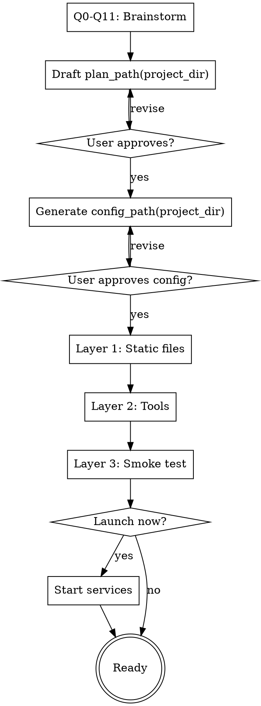

# Creating a Cryochamber Application

## Overview

Guide users through creating a cryochamber application via conversational Q&A. Four phases: brainstorm the plan, configure cryo.toml, validate everything works, optionally launch.

Assumes cryo CLI is installed and on PATH.

## Path Model

Use a small path layer before writing any files. This keeps existing projects clean
without changing `cryo init`.

Conceptual helpers:

- `chamber_dir(project_dir)` — where Cryochamber files live. For an existing
  non-empty project, default to `project_dir/.cryo`. For a standalone chamber,
  this is the selected chamber directory itself.
- `plan_path(project_dir)` — `chamber_dir(project_dir)/plan.md`
- `config_path(project_dir)` — `chamber_dir(project_dir)/cryo.toml`
- `notes_path(project_dir)` — `chamber_dir(project_dir)/NOTES.md`
- `messages_dir(project_dir)` — `chamber_dir(project_dir)/messages`

Track two explicit directories:

- `project_dir` — the directory whose files the agent is meant to work on.
- `chamber_dir` — the directory passed as cwd to `cryo` commands and where
  `plan.md`, `cryo.toml`, `NOTES.md`, and `messages/` are stored.

Resolution rules:

- If the current directory contains `cryo.toml`, treat it as an existing
  standalone chamber: `project_dir = cwd`, `chamber_dir = cwd`.
- If the current directory contains `.cryo/cryo.toml`, reuse it:
  `project_dir = cwd`, `chamber_dir = cwd/.cryo`.
- If the current directory is non-empty and does not already contain
  `cryo.toml`, ask: "This looks like an existing project. Store Cryochamber
  files in `.cryo/` here? [Y/n]". Default to yes. If accepted, set
  `project_dir = cwd`, `chamber_dir = cwd/.cryo`.

In project-local `.cryo` mode, do not write `AGENTS.md`, `CLAUDE.md`,
`plan.md`, or `cryo.toml` into the project root.

When using a project-local `.cryo` chamber, make the generated plan explicit:
the agent should treat `..` as the project root and use `NOTES.md` in the
chamber directory for memory. From the project root, that memory file is
`.cryo/NOTES.md`.

## Phase 1: Brainstorm the Plan

Ask questions **one at a time**. Suggest answers based on the task. Multiple choice where possible.

### Q0. Where should the chamber live?

Ask up front — this affects sync paths, Cryohub registration/config, and `.gitignore`
patterns. Suggest a sensible default based on context:

- **Inside this existing project** (default when cwd is non-empty) —
  `./.cryo/`. Keeps Cryochamber files out of the project root. The agent should
  work on the project through `..` from inside the chamber.
- **In the global Cryohub root** (recommended for dashboard-first use) —
  `~/.cryo/chambers/<name>/` by default. Cryohub can also be configured with
  `chamber_root = "/path/to/project/.cryo/chambers"` for project-owned chamber
  collections.
- **Standalone** — `~/cryo/<name>/` or any other directory. It will appear in
  Cryohub after `cryo start` registers it.

Confirm `project_dir` and `chamber_dir` before moving on. Create `chamber_dir`
if it doesn't exist.

### Q1. What's the task?

Open-ended: "What should the agent do each session?"

### Q2. Schedule pattern

Suggest based on Q1, then ask:
- **Periodic** (every N minutes/hours) — monitoring, scraping, reminders
- **Event-driven** (react to inbox messages) — responding to human input
- **Adaptive** (adjust pace based on activity) — correspondence games, polling
- **Interactive schedule table** — build a multi-step schedule collaboratively (e.g. "Day 1: send CFP, Day 7: remind reviewers, Day 14: collect results"). Good for conference organizing, editorial calendars, multi-phase projects. Co-create the table with the user row by row.

### Q3. External tools

Analyze the task and suggest likely tools (e.g. "this sounds like it needs a web scraper — would curl or a Python script work?"). **Skip if the task clearly needs no external tools.**

### Q5. Persistent state

What does the agent need to remember across sessions? Suggest based on task (counters, progress markers, data snapshots, timestamps, scheduled reminders). Two cross-session primitives are available — see the **State primitives** reference below.

#### State primitives reference

| Primitive | What it stores | When to use |
|---|---|---|
| `cryo-agent todo add "..." --at <ISO>` / `todo list` / `todo done <id>` | A list of items, each with optional scheduled deadline | Anything time-scheduled: reminders, deadlines, periodic tasks. The daemon surfaces `todo list` on wake, and the `--at` values make scheduling decisions machine-readable. |
| `NOTES.md` | Free-form agent-managed text | Auxiliary state: counters, fired-reminder markers, the last summary timestamp, game position snapshots, anything without a deadline. |

Rule of thumb: if the thing has a **time** associated with it, prefer `todo --at`. Otherwise append to `NOTES.md`. Use both in combination when needed (e.g. `todo` stores the reminder, `NOTES.md` marks it already fired).

### Q6. Failure & retry strategy

What if the agent crashes or hangs? The daemon's contract is fixed and not configurable: a session that exits without `cryo-agent hibernate` causes the daemon to mark each claimed TODO done and add a fresh retry TODO with an `(attempt k)` suffix and a `2^k`-minute delay (capped at 1 day). Retries continue at growing intervals until the TODO is manually marked done or a session succeeds.

Discuss with the user: at what attempt count would they want to be alerted, and via what channel? Encode that as a rule in `plan.md` (e.g. "if a TODO reaches `(attempt 5)`, send a help message before retrying further").

### Q7. AI agent & providers

Which agent command? **Default to `opencode` unless the user explicitly asks for
something else** — it is the supported headless agent for Cryochamber and the
rest of this skill (permission snippet in Q8, smoke test in Phase 3) assumes it.
Only switch when the user names a different agent.

- **opencode** (default, recommended) — headless coding agent
- **claude** — Anthropic's Claude CLI
- **codex** — OpenAI's Codex CLI
- **custom** — any command

Then: API key configuration. The agent process inherits one provider's env via a `[provider]` block in `cryo.toml`:
- If the user has an API key now, capture the env var name and value (e.g. `ANTHROPIC_API_KEY=sk-ant-...`) plus any model selection vars (e.g. `OPENCODE_PROVIDER`, `OPENCODE_MODEL`). Phase 2 will write a `[provider]` block that injects them into every spawned agent session.
- If the user wants to configure the provider later: skip for now and in Phase 4 tell them how to add a `[provider]` block to `cryo.toml`.
- If the agent picks credentials up some other way (e.g. `opencode auth login` keychain), no `[provider]` block is needed.

(One active provider per chamber; provider rotation is not supported.)

### Q8. Agent permissions

Ask how much filesystem/tool authority the launched agent should have. For
OpenCode, recommend a policy and tell the user that permissions belong in
OpenCode config (`opencode.json` or user config), not in `cryo.toml`.

Recommended choices:
- **Project edits allowed, outside edits denied** (recommended for most) —
  agent may edit files in `project_dir` and `chamber_dir` by default. External
  paths require an explicit allowlist and are read-only by default. For
  OpenCode: set `external_directory` to allow `project_dir` when `chamber_dir`
  is `project_dir/.cryo`, because the launched agent's cwd is the chamber. For
  unattended chambers, avoid unresolved `ask` prompts.
- **Strict sandbox** — edit only chamber files and deny other external
  directory access. Use only when the task does not need to modify project
  files; otherwise it is too restrictive for normal Cryochamber work.
- **Broad project maintainer** — allow edits in a larger workspace/repo set.
  Use only for trusted agents and explicit paths; still deny secrets and
  destructive commands.

For OpenCode, suggest this baseline unless the task needs more. Replace
`<PROJECT_DIR>` and `<CHAMBER_DIR>` with absolute paths. If
`project_dir == chamber_dir`, omit the `external_directory` project allowlist
and keep only the deny/ask default for paths outside the chamber.
Do not deny project edits by default: the point is to block writes outside the
selected project, not to make the agent read-only.
For interactive chambers, change catch-all `deny` rules to `ask` where human
approval is acceptable. For unattended chambers, prefer `deny` plus explicit
allowlists so the agent cannot hang waiting for approval.

```json
{
  "permission": {
    "external_directory": {
      "*": "deny",
      "<PROJECT_DIR>/**": "allow"
    },
    "read": {
      "*": "allow",
      "*.env": "deny",
      "*.env.*": "deny",
      ".cryo/zuliprc": "deny"
    },
    "edit": {
      "*": "deny",
      "<PROJECT_DIR>/**": "allow",
      "<CHAMBER_DIR>/**": "allow",
      "*.env": "deny",
      "*.env.*": "deny",
      ".cryo/zuliprc": "deny"
    },
    "bash": {
      "*": "deny",
      "cryo-agent *": "allow",
      "rg *": "allow",
      "git status*": "allow",
      "git diff*": "allow",
      "cargo test*": "allow",
      "rm *": "deny",
      "sudo *": "deny",
      "git reset *": "deny",
      "git push *": "deny"
    }
  }
}
```

If external reading is useful, prefer narrow allowlists plus edit denial:

```json
{
  "permission": {
    "external_directory": {
      "*": "deny",
      "~/Documents/reference/**": "allow",
      "<PROJECT_DIR>/**": "allow"
    },
    "edit": {
      "~/Documents/reference/**": "deny"
    }
  }
}
```

Record the selected policy in the generated plan. If the agent is not OpenCode,
record the intent ("workspace-only edits, read-only external references") and
tell the user to apply the equivalent permission controls in that agent.

### Q9. Delayed wake reaction

If the machine was suspended and the agent wakes 5+ minutes late, how should it react? Suggest based on task:
- **Adjust and continue** (recommended for most) — recalculate deadlines, skip missed steps, catch up
- **Alert the human** — send a message about the delay, then proceed (recommended for time-sensitive tasks)
- **Abort the session** — exit with error, let human decide
- **Ignore** — treat as normal wake

### Q10. Notification & sync channel

How should the agent communicate with the user?
- **Hub (Web UI)** (recommended, default) — browser via `cryohub start`. Cryohub is global and registry-backed; it can be started from any directory and shows chambers created in the UI or registered by `cryo start`. Host, port, and dashboard-created chamber root are in `~/.config/cryo/cryohub.toml` (or `$XDG_CONFIG_HOME/cryo/cryohub.toml`), with defaults `127.0.0.1:8765` and `~/.cryo/chambers`. For project-owned chamber collections, set `chamber_root` to `<project>/.cryo/chambers`. For remote access use `cryohub start --host 0.0.0.0`; if 8765 is taken, pick a free port (check with `ss -tlnp | grep :8765`) and confirm with the user.
- **Zulip** (advanced) — rich web UI, bot support, persistent history. Walk through: zuliprc path, stream name, sync interval. **Before Phase 3:** the bot (whoever owns the API key in the zuliprc) must be subscribed to the target stream; otherwise `cryo-zulip init` fails when resolving the stream. Remind the user to add the bot in Zulip's stream settings.
- **None** — agent runs silently, check logs manually.

### Output

After all questions:
1. Draft `plan_path(project_dir)` with **Goal**, **Tasks**, **Configuration**, and **Notes** sections
2. For interactive schedule tables: embed the schedule as a markdown table in Tasks
3. Include delayed wake handling instructions in Tasks
4. Include persistent state strategy in Notes (map each piece of state to `todo --at` vs. `NOTES.md` — see the State primitives reference in Q5)
5. Include a `cryo-agent time` usage note: the tool accepts `(no arg)` for current time, `+N minutes|hours|days|weeks` for offsets, or an ISO8601 string like `2026-04-25T10:00` as pass-through. It does **not** parse natural-language expressions ("tomorrow 9am"). For those, the agent should fetch the current time with `cryo-agent time`, compute the absolute ISO timestamp itself, and pass that directly to `todo add --at`.
6. If `chamber_dir` is `project_dir/.cryo`, include a short Configuration note:
   "Project root is `..`; keep chamber memory in `NOTES.md`."
7. Include the selected agent permission policy in Notes. For OpenCode, include
   the exact config path/action the user should take before Phase 3 if the
   policy differs from their current default.
8. Present draft to user for approval/edits
9. Write the file at `plan_path(project_dir)`

Reference existing examples for plan.md structure:
- `examples/chambers/mr-lazy/plan.md` — simple periodic task
- `examples/chambers/chess-by-mail/plan.md` — adaptive event-driven task

## Phase 2: Configure cryo.toml

Generate `config_path(project_dir)` from Phase 1 answers. No new questions —
everything maps directly.

| Brainstorm answer | cryo.toml field |
|---|---|
| AI agent (Q7) | `agent` |
| Provider env (Q7) | `[provider]` with `name` and `env = { ... }` map |
| Agent permissions (Q8) | Not a `cryo.toml` field. Record in `plan.md`; configure in the agent's own permission config (for OpenCode, `opencode.json` or user config). |
| Sync channel (Q10) — Hub (Web UI) (recommended) | Host, port, and dashboard-created chamber root live in `cryohub.toml`; nothing goes in per-chamber `cryo.toml`. |

Process:
1. Generate `config_path(project_dir)` with values filled in and commented explanations
2. Present to user — highlight non-default values and explain why each was chosen
3. If Zulip sync chosen, note that `cryo-zulip init` will run in Phase 3
4. If OpenCode is selected, present the recommended permission snippet separately
   from `cryo.toml`; ask before writing or changing `opencode.json`.
5. Write the file at `config_path(project_dir)`

## Phase 3: Validate

Three layers, in order. On failure: stop, report what failed, suggest fixes, let user retry that layer.

### Layer 1: Static file + binary validation (no API calls)

- Verify `plan_path(project_dir)` exists and contains Goal and Tasks sections
- Verify `config_path(project_dir)` parses correctly: run `cryo init` in
  `chamber_dir` — it's idempotent and will print "(exists, kept)" for
  pre-existing files. Failure here means TOML is malformed. Running it in
  `chamber_dir` keeps generated chamber files out of `project_dir`.
- Verify the agent command is on PATH (e.g. `which opencode`)
- If OpenCode permissions were configured, verify the expected `permission`
  block exists in `opencode.json` or the selected user config before live smoke
  testing.

These checks are free. If any fails, stop — don't proceed to the live smoke test in Layer 3, which will fail in a more confusing way.

### Layer 2: External tool validation

- For each external tool referenced in `plan_path(project_dir)`: run a smoke test
  - Scripts: verify they exist and execute (e.g. `uv run chess_engine.py board`)
  - APIs: verify endpoints are reachable (e.g. `curl -sf https://... > /dev/null`)
  - Env vars: verify required variables are set and non-empty
- If a `[provider]` block is configured: validate the env vars it injects (e.g. `ANTHROPIC_API_KEY` is non-empty)

### Layer 3: Live smoke test

This is the only place the agent actually runs. It catches misconfigured API keys,
broken agent installs, and sync credential issues.

1. If a sync channel is configured, initialize it first so the smoke run can exercise it:
   - Zulip: `cryo-zulip init --config <path> --stream <name>`. Needs the bot subscribed
     to the stream (see Q10 pre-flight).
2. Run `CRYO_NO_SERVICE=1 cryo start` from `chamber_dir` (direct-spawn mode —
   simpler to cancel than a launchd/systemd service).
3. Wait for the first session to complete: watch `cryo.log` for
   `agent started` → `hibernate:` → `session complete` → `--- CRYO END ---`.
4. Run `cryo cancel` from `chamber_dir` to clean up.
5. Report: session count, exit code from `cryo.log`, any errors, and whether the
   agent sent a Zulip test message (if applicable).

On success: "Your cryo application is ready."

## Phase 4: Launch

Ask the user if they want to launch the plan immediately.

- If yes: run `cryo start` from `chamber_dir` (and `cryo-zulip sync` from `chamber_dir` if a sync channel was configured). Report the status with `cryo status`.
- If no: print instructions for launching later from `chamber_dir` (`cryo start`, sync commands if applicable, `cryo watch`).

If the user deferred provider setup in Q7, remind them how to configure it:
- Edit `config_path(project_dir)` and add a `[provider]` block with `name` and `env` map, e.g.:
  ```toml
  [provider]
  name = "opencode"
  env = { OPENCODE_PROVIDER = "anthropic", OPENCODE_MODEL = "claude-sonnet-4-20250514", ANTHROPIC_API_KEY = "sk-ant-..." }
  ```
- Warn: add `config_path(project_dir)` to `.gitignore` if it contains API keys.

## Process Flow



## Common Mistakes

| Mistake | Fix |
|---|---|
| Hardcoded timestamps in `plan_path(project_dir)` | Always compute times via `cryo-agent time` (relative) or an ISO8601 string the agent constructed |
| Passing natural language to `cryo-agent time` (e.g. `"tomorrow 9am"`) | Only `+N minutes\|hours\|days\|weeks` and ISO8601 (`2026-04-25T10:00`) are accepted. Agent must reason about NL expressions itself. |
| Appending to `NOTES.md` for time-scheduled items | Use `todo add "..." --at <ISO>` for anything with a deadline; `NOTES.md` is for auxiliary state without a deadline. |
| Missing hibernation in plan — treated as crash | Every task path must end with `cryo-agent hibernate` |
| Provider env vars not set | Validate in Phase 3 before starting |
