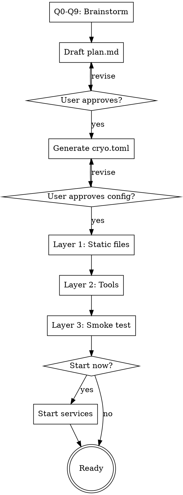

# Creating a Cryochamber Application

## Overview

Guide users through creating a cryochamber application via conversational Q&A. Four phases: brainstorm the plan, configure cryo.toml, validate everything works, optionally start.

Assumes cryo CLI is installed and on PATH.

## Phase 1: Brainstorm the Plan

Ask questions **one at a time**. Suggest answers based on the task. Multiple choice where possible.

### Q0. Where should the chamber live?

Ask up front — this affects sync paths, workspace discovery (`cryohub`), and `.gitignore`
patterns. Suggest a sensible default based on context:

- **In a workspace** (recommended) — `<workspace>/chambers/<name>/`, where the workspace
  is a parent directory containing multiple chambers. `cryohub` runs at the workspace
  level and lists every chamber under `chambers/`.
- **Standalone** — `~/cryo/<name>/` or any other directory. Simpler if you only ever run
  one chamber, but `cryohub` still requires a workspace layout (a symlink in
  `<workspace>/chambers/<name>` works).

Confirm the exact path before moving on. Create the directory if it doesn't exist.

### Q1. What's the task?

Open-ended: "What should the agent do each session?"

### Q2. Schedule pattern

Suggest based on Q1, then ask:
- **Periodic** (every N minutes/hours) — monitoring, scraping, reminders
- **Event-driven** (react to inbox messages) — responding to human input
- **Adaptive** (adjust pace based on activity) — correspondence games, polling
- **Interactive schedule table** — build a multi-step schedule collaboratively (e.g. "Day 1: send CFP, Day 7: remind reviewers, Day 14: collect results"). Good for conference organizing, editorial calendars, multi-phase projects. Co-create the table with the user row by row.

### Q3. External tools

Analyze the task and suggest likely tools (e.g. "this sounds like it needs a web scraper — would curl or a Python script work?"). **Skip if the task clearly needs no external tools.**

### Q4. Human interaction

Recommend based on task:
- **No interaction** (autonomous) — monitoring, automation
- **One-way** (agent sends reports) — scraping, summarization (Recommended for most tasks)
- **Two-way** (human sends commands/data) — games, collaborative planning

### Q5. Persistent state

What does the agent need to remember across sessions? Suggest based on task (counters, progress markers, data snapshots, timestamps, scheduled reminders). Two cross-session primitives are available — see the **State primitives** reference below.

#### State primitives reference

| Primitive | What it stores | When to use |
|---|---|---|
| `cryo-agent todo add "..." --at <ISO>` / `todo list` / `todo done <id>` | A list of items, each with optional scheduled deadline | Anything time-scheduled: reminders, deadlines, periodic tasks. The daemon surfaces `todo list` on wake, and the `--at` values make scheduling decisions machine-readable. |
| `NOTES.md` | Free-form agent-managed text | Auxiliary state: counters, fired-reminder markers, the last summary timestamp, game position snapshots, anything without a deadline. |

Rule of thumb: if the thing has a **time** associated with it, prefer `todo --at`. Otherwise append to `NOTES.md`. Use both in combination when needed (e.g. `todo` stores the reminder, `NOTES.md` marks it already fired).

### Q6. AI agent & provider

Which agent command?
- **opencode** (default) — headless coding agent
- **claude** — Anthropic's Claude CLI
- **codex** — OpenAI's Codex CLI
- **custom** — any command

Then: do you want to inject API keys / provider env vars into the agent process?
- If yes: configure `[provider]` with a `name` and `env` map. Example:
  ```toml
  [provider]
  name = "anthropic"
  env = { ANTHROPIC_API_KEY = "sk-ant-..." }
  ```
  Cryochamber injects only one provider per chamber — there is no rotation across multiple keys. If you need to swap providers, edit `cryo.toml`.
- If the user wants to set up the provider later: skip for now and in Phase 4 tell them how to add `[provider]` to `cryo.toml`.
- If no: skip — the agent will inherit the daemon's environment.

### Q7. Delayed wake reaction

If the machine was suspended and the agent wakes 5+ minutes late, how should it react? Suggest based on task:
- **Adjust and continue** (recommended for most) — recalculate deadlines, skip missed steps, catch up
- **Alert the human** — send a message about the delay, then proceed (recommended for time-sensitive tasks)
- **Abort the session** — exit with error, let human decide
- **Ignore** — treat as normal wake

### Q8. Notification & sync channel

How should the agent communicate with the user?
- **Zulip** (recommended) — rich web UI, bot support, persistent history. Walk through: zuliprc path, stream name, sync interval. **Before Phase 3:** the bot (whoever owns the API key in the zuliprc) must be subscribed to the target stream; otherwise `cryo-zulip init` fails when resolving the stream. Remind the user to add the bot in Zulip's stream settings.
- **GitHub Discussions** — good for repo-centric workflows. Walk through: repo, discussion category.
- **Hub (Web UI) only** — simplest, browser via `cryohub start`. `cryohub` always operates on the current directory and expects to be run from a directory whose immediate subdirectories are chambers (not from a chamber dir itself). Host/port are CLI flags (`cryohub start --host 0.0.0.0 --port 8765`), not `cryo.toml` fields; default is `127.0.0.1:8765`. For remote access use `--host 0.0.0.0`. If 8765 is taken, pick a free port (check with `ss -tlnp | grep :8765`) and confirm with the user.
- **None** — agent runs silently, check logs manually.

### Q9. Periodic reports

Want daily/hourly health summaries written to `messages/outbox/` (delivered via any configured sync channel)?
- If yes: set `report_time` (e.g. "09:00") and `report_interval` (hours, e.g. 24 for daily).
- If no: skip (disabled by default).

### Output

After all questions:
1. Draft `plan.md` with **Goal**, **Tasks**, **Configuration**, and **Notes** sections
2. For interactive schedule tables: embed the schedule as a markdown table in Tasks
3. Include delayed wake handling instructions in Tasks
4. Include persistent state strategy in Notes (map each piece of state to `todo --at` vs. `NOTES.md` — see the State primitives reference in Q5)
5. Include a `cryo-agent time` usage note: the tool accepts `(no arg)` for current time, `+N minutes|hours|days|weeks` for offsets, or an ISO8601 string like `2026-04-25T10:00` as pass-through. It does **not** parse natural-language expressions ("tomorrow 9am"). For those, the agent should fetch the current time with `cryo-agent time`, compute the absolute ISO timestamp itself, and pass it to `cryo-agent todo add ... --at <ISO>`. The next wake is computed from due TODOs and `report_time`; `cryo-agent hibernate` has no `--wake` flag.
6. Present draft to user for approval/edits
7. Write the file

Reference existing examples for plan.md structure:
- `examples/chambers/mr-lazy/plan.md` — simple periodic task
- `examples/chambers/chess-by-mail/plan.md` — adaptive event-driven task

## Phase 2: Configure cryo.toml

Generate from Phase 1 answers. No new questions — everything maps directly.

| Brainstorm answer | cryo.toml field |
|---|---|
| AI agent (Q6) | `agent` |
| Human interaction (Q4) | `watch_inbox` (two-way → true, autonomous → false) |
| Sync channel (Q8) — Zulip | `zulip_poll_interval` (init itself is a separate `cryo-zulip init` in Phase 3) |
| Sync channel (Q8) — Hub (Web UI) | Host/port are CLI flags for `cryohub start`; nothing goes in `cryo.toml`. |
| Reports (Q9) | `report_time`, `report_interval` |
| Provider env (Q6) | `[provider]` (single profile, no rotation) |
| Delayed wake (Q7) | (no cryo.toml field — goes into plan.md prose only) |

Process:
1. Generate `cryo.toml` with values filled in and commented explanations
2. Present to user — highlight non-default values and explain why each was chosen
3. If Zulip or GitHub sync chosen, note that `cryo-zulip init` / `cryo-gh init` will run in Phase 3
4. Write the file

## Phase 3: Validate

Three layers, in order. On failure: stop, report what failed, suggest fixes, let user retry that layer.

### Layer 1: Static file + binary validation (no API calls)

- Verify `plan.md` exists and contains Goal and Tasks sections
- Verify `cryo.toml` parses correctly: run `cryo status` in the chamber directory — it calls `load_config` and will fail loudly if the TOML is malformed. (`cryo init` only scaffolds missing files; it does not parse an existing `cryo.toml`.)
- Verify the agent command is on PATH (e.g. `which opencode`)

These checks are free. If any fails, stop — don't proceed to the live smoke test in Layer 3, which will fail in a more confusing way.

### Layer 2: External tool validation

- For each external tool referenced in `plan.md`: run a smoke test
  - Scripts: verify they exist and execute (e.g. `uv run chess_engine.py board`)
  - APIs: verify endpoints are reachable (e.g. `curl -sf https://... > /dev/null`)
  - Env vars: verify required variables are set and non-empty
- If provider rotation configured: validate each provider's env vars

### Layer 3: Live smoke test

This is the only place the agent actually runs. It catches misconfigured API keys,
broken agent installs, and sync credential issues.

1. If a sync channel is configured, initialize it first so the smoke run can exercise it:
   - Zulip: `cryo-zulip init --config <path> --stream <name>`. Needs the bot subscribed
     to the stream (see Q8 pre-flight).
   - GitHub: `cryo-gh init --repo <repo>`.
2. Run `CRYO_NO_SERVICE=1 cryo start` (direct-spawn mode — simpler to cancel than a
   launchd/systemd service).
3. Wait for the first session to complete: watch `cryo.log` for
   `agent started` → `hibernate:` → `session complete` → `--- CRYO END ---`.
4. Run `cryo cancel` to clean up.
5. Report: session count, exit code from `cryo.log`, any errors, and whether the
   agent sent a Zulip/GitHub test message (if applicable).

On success: "Your cryo application is ready."

## Phase 4: Start

Ask the user if they want to start the plan immediately.

- If yes: run `cryo start` (and `cryo-zulip sync` / `cryo-gh sync` if a sync channel was configured). Report the status with `cryo status`. Note that `cryo start` and `cryo-zulip sync` / `cryo-gh sync` install launchd/systemd user services that survive reboots; uninstall with `cryo cancel` and `cryo-zulip unsync` / `cryo-gh unsync` respectively.
- If no: print instructions for starting later (`cryo start`, sync commands if applicable, `cryo watch`).

If the user deferred provider setup in Q6, remind them how to configure it:
- Edit `cryo.toml` and add a single `[provider]` block with `name` and `env` map:
  ```toml
  [provider]
  name = "anthropic"
  env = { ANTHROPIC_API_KEY = "sk-ant-..." }
  ```
- Cryochamber injects only one provider per chamber — there is no rotation. To switch keys, edit `cryo.toml` and restart the daemon.
- Warn: add `cryo.toml` to `.gitignore` if it contains API keys.

## Process Flow



## Common Mistakes

| Mistake | Fix |
|---|---|
| Hardcoded timestamps in plan.md | Always compute times via `cryo-agent time` (relative) or an ISO8601 string the agent constructed |
| Passing natural language to `cryo-agent time` (e.g. `"tomorrow 9am"`) | Only `+N minutes\|hours\|days\|weeks` and ISO8601 (`2026-04-25T10:00`) are accepted. Agent must reason about NL expressions itself. |
| Writing time-scheduled items into `NOTES.md` | Use `cryo-agent todo add "..." --at <ISO>` for anything with a deadline; `NOTES.md` is for deadline-free auxiliary state. |
| Missing hibernation in plan — treated as crash | Every task path must end with `cryo-agent hibernate` |
| `watch_inbox = false` with two-way interaction | Set `watch_inbox = true` for event-driven tasks |
| Zulip bot not subscribed to target stream | `cryo-zulip init` fails to resolve — add the bot in Zulip's stream settings first |
| Provider env vars not set | Validate in Phase 3 before starting |
