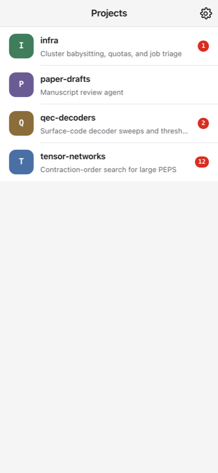
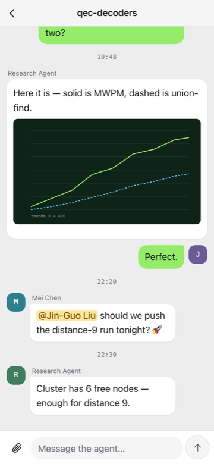
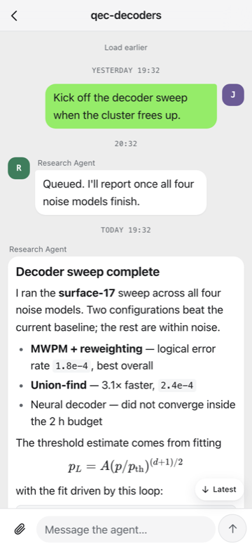

# Agent Console — developer notes

The Agent Console is the web surface `cryohub` serves. **User documentation
lives in the mdbook:** [Agent Console](https://giggleliu.github.io/cryochamber/agent-console.html)
(sign-in, owner vs guest, invites, PWA install, public deployment behind
Caddy). This file is only about working on the app.

It is a static site — Vite + React + TypeScript, Zustand for state,
markdown-it + KaTeX + DOMPurify for message bodies — that talks to the hub's
REST API and SSE stream on its own origin. No backend of its own, no database,
no telemetry. `console/` was imported as a squashed subtree, so `git log
console/` starts at the import.

The same bundle also runs inside the native shell (multi-hub app mode) behind
an `isTauri()` gate, with no Tauri npm dependency — see
[`app/README.md`](../app/README.md).

<p align="center">
  
  
  
</p>

## Develop

Node ≥ 22, the version CI builds with.

```sh
npm ci
npm run dev        # http://localhost:5173 — /api proxies to 127.0.0.1:8765
npm test           # unit and component tests (Vitest)
npm run e2e        # Playwright end-to-end tests against a mocked hub
npm run build      # type-check, then emit static files to dist/
```

`npm run dev` needs a hub on `127.0.0.1:8765` (`cryohub start --foreground` in
another terminal). Sign in with the owner token (`cryohub token owner`) or an
invite link.

`npm run e2e` starts its own dev server on 5173. If that port is already taken —
another checkout, another worktree — set `E2E_PORT` (e.g. `E2E_PORT=5199 npm run
e2e`) so the suite tests *this* tree rather than silently reusing whatever is
already listening. In CI the suite runs on Chromium and keeps an HTML report on
failure.

From the repo root, `make console-check` runs `npm ci`, `tsc --noEmit` and
Vitest; `make check` includes it.

## Ship a build to a running hub

The released `cryohub` embeds `console/dist/` at compile time, so a normal
install has nothing to configure. While developing you can serve *this
checkout's* build instead:

```sh
make console-build          # from the repo root: npm ci && npm run build → console/dist/
```

then in `~/.config/cryo/cryohub.toml`:

```toml
console_dir = "/absolute/path/to/cryochamber/console/dist"
```

and `cryohub restart`. The path must be absolute — the hub canonicalizes it
from the service process's working directory. `cryohub status` prints
`Console: embedded` or `Console: <path> (present|missing)`. Remove the key to
go back to the embedded build.

To bake a fresh build into the binary: `make console-build && cargo build`.

### Updates

`npm run build` writes `dist/precache.json` (a build hash plus the list of
files the service worker precaches). A page that is open when a new build is
served keeps running the old one until the user taps **Reload** on the
"Update available" bar — the worker never swaps code under a live session, and
nothing that is not a `2xx` is ever cached, so a bad deploy cannot be pinned
offline. Hashed `/assets/*` files are served cache-first; everything else is
network-first.

## Project layout

```
src/api/             hub client (typed methods, ApiError), hub router (one client per saved hub in app mode), SSE reader, types
src/store/           app state (Zustand), hub accounts, credential storage, local cache
src/hooks/           the event loop (one SSE stream per hub, backoff, resync)
src/components/      MessageBody + sanitizer, Composer, Sheet, UpdateBar, icons
src/views/           Login, Projects, Conversation, Settings, Invite, Controls, New chamber, Add chamber (app mode)
src/views/controls/  the Controls sheet's tabs: todos, plan/notes, sync, settings, log
src/lib/             markdown+KaTeX renderer, theme, outbox, SW update flow, Tauri seam (native store, pinned fetch), helpers
src/styles.css       the design system (tokens first, then components, then dark)
public/sw.js         service worker: precache list, cache-first assets, update prompt
e2e/                 Playwright: smoke + layout contract, hub flows, screenshot harness
scripts/             icon generation from public/icons/icon.svg
deploy/Caddyfile     the reverse-proxy block the mdbook guide quotes
```

## Regenerating the app icon

Edit `public/icons/icon.svg`, then:

```sh
node scripts/generate-icons.mjs          # rewrites icon-180/192/512.png
node scripts/generate-maskable-icon.mjs  # rewrites icon-maskable-512.png
```

Both render through the Chromium that Playwright already installs, so there is
no extra dependency. The maskable variant insets the mark so the OS's circular /
squircle crop never clips it. The PNGs are committed, so a plain `npm run build`
never needs a browser.

## Trust boundary

Message content from the server is not trusted. Markdown is rendered
client-side and then sanitized before it reaches the DOM: an allowlist of tags
and attributes, inline styles filtered down to the properties KaTeX needs (no
URLs, no fixed positioning, clamped lengths), `url()` stripped from SVG paint
attributes. See `src/components/sanitize.ts`. The hub adds a CSP on the page.
