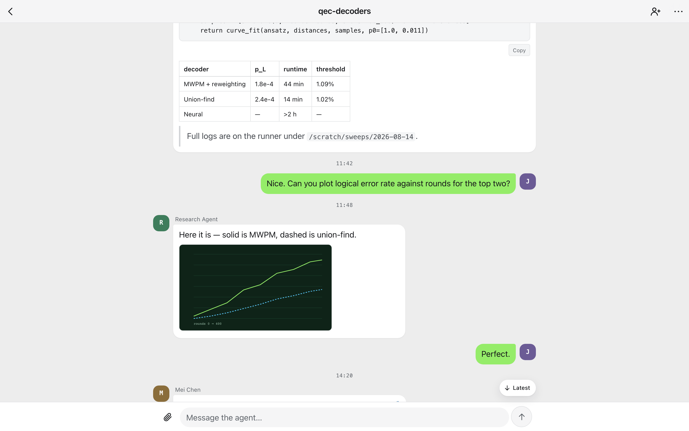

# Agent Console

The **Agent Console** is the web surface `cryohub` serves — a phone-first,
installable app for reading and steering every chamber the hub knows about.
One chamber is one flat conversation: the agent's reports and questions on one
side, your replies on the other, with the chamber's controls a tap away.

It is **embedded in the `cryohub` binary**. There is nothing to install: start
the hub and open the URL it prints.

```bash
cryohub start        # http://127.0.0.1:8765
```



## Signing in

`cryohub start` runs in **public mode**: every `/api` route needs a bearer
token, and the console shows a login screen. The first run creates the owner
token and prints it — that line is your login, so keep it:

```
Owner token (save it — or reprint later with `cryohub token owner`):
3f9c…
```

Two kinds of token open the console:

- **The owner token.** Printed by the first `cryohub start`, and reprintable
  any time with `cryohub token owner` (idempotent — the same secret). Paste it
  into *Access token*. This is you: full control of every chamber.
- **An invite link.** Someone with the owner token mints a link scoped to one
  chamber and sends it to you. Opening the link *is* signing in — the token
  rides in the `#invite=` fragment, is stored, and is stripped from the address
  bar before anything else runs.

There are no accounts, passwords or e-mail. A token is the identity.

`cryohub start --no-public` opts out: no login, and the hub is open to whoever
can reach `127.0.0.1`. Sharing and invite links do not work in open mode.

## Owner surface vs. guest surface

| | Owner | Invite holder |
|---|---|---|
| Projects list | every chamber, with status dots, next wake, open-question badge, Completed / Archived groups | only the invited chamber(s), flat |
| Conversation | read, send, upload files, open attachments | same, for the invited chamber only |
| **⋯ Chamber controls** (launch, stop, restart, reset, archive; Todos · Plan · Notes · Sync · Settings · Log tabs) | yes | never shown |
| **Invite** (mint links, People with access, Remove) | yes | never shown |
| **+ New chamber**, *Refresh chambers*, *Show completed & archived* | yes | never shown |

The table is a UI decision on top of the real one: the hub classifies every
route **default-deny**. A guest calling an owner route directly — chamber
status, todos, lifecycle, sync, token management — gets `403` regardless of what
the app draws, and a guest's live event stream never carries log lines or
other chambers' messages.

## Inviting someone to a chamber

1. Sign in with the owner token, open the chamber, tap **Invite** in its header.
2. Optionally name the person (blank becomes `guest-1`, `guest-2`, …; names are
   unique across the hub), then **Copy invite link**. The link is minted,
   scoped to that one chamber, and copied in a single gesture.
3. Send it. It is shown **once**; the hub does not show it again. Lost link,
   new link.
4. **People with access** on the same sheet lists every active link that
   reaches this chamber. **Remove** revokes one after a confirm: the link stops
   working immediately, the guest's open event stream ends, and their next
   request gets `401`, dropping them at the login screen with *"Your session is
   no longer valid — please sign in again."* (Opening the revoked link itself
   says *"This invite link is no longer valid."*)

Sharing needs public mode — on an open loopback hub the sheet says so instead
of minting a link nobody would need.

The same tokens can be managed from the CLI:

```bash
cryohub token create --name alice --chambers qec-decoders   # prints the link fragment once
cryohub token list
cryohub token revoke alice
```

## Installing it on a phone or desktop

The console is a PWA. Once it is open in a browser:

- **Android / Chrome:** *⋮ → Add to Home screen* (or *Install app*).
- **iOS / Safari:** *Share → Add to Home Screen*.
- **macOS:** Chrome *Install*, or Safari *File → Add to Dock*.

The installed app is bound to the hub that served it — one hub per install.
Updates arrive with the hub: after a `cargo install cryochamber` upgrade and
`cryohub restart`, the open app shows an *Update available · Reload* bar.

There are **no push notifications** by design: the app syncs while it is open.
It is a console you check, not a pager.

## Public deployment (phone outside your network)

`cryohub` stays bound to loopback. To reach it from a phone on the go, put a
TLS-terminating reverse proxy in front of it. Public mode is already on, so
there is nothing to switch — just make sure you have the owner token.

```bash
cryohub start                # bearer auth on every /api route; prints the owner token on first run
cryohub token owner          # or reprint it later — it is your login
```

Caddy is the documented proxy. Copy this to `/etc/caddy/Caddyfile`, replace
the hostname (it needs an A/AAAA record pointing at the host *before* you
reload, or no certificate can be issued), and `systemctl reload caddy`:

```caddyfile
agents.example.com {
	encode zstd gzip
	reverse_proxy 127.0.0.1:8765
}
```

The hub rejects any request whose `Host` header is neither loopback nor a
configured name — that is what stops DNS rebinding — and Caddy forwards the
public hostname by default, so allow it in `cryohub.toml`:

```toml
public_hosts = ["agents.example.com"]
```

(The alternative is `header_up Host 127.0.0.1` inside the `reverse_proxy`
block.) Then open `https://agents.example.com` on the phone, paste the owner
token or open an invite link, and *Add to Home Screen*.

The console's own pages stay unauthenticated under `--public` — they are the
login screen. Everything under `/api` is behind the token.

In public mode every credential — guests and the owner alike — is throttled on
sends and uploads to a burst of 5 and 10 per minute; past that the hub answers
`429` with a `Retry-After` header. Every accepted send wakes an agent, so the
limit is what keeps an invite link from running up the owner's bill.

## Serving a build from somewhere else (`console_dir`)

You never need this to use the console. It exists for development and for
running a console build that is newer or different from the one embedded in
the binary:

```toml
# ~/.config/cryo/cryohub.toml
console_dir = "/home/alice/src/cryochamber/console/dist"
```

The path must be **absolute** (the hub canonicalizes it from the service
process's working directory, which launchd/systemd choose). `make
console-build` produces `console/dist/`; `cryohub restart` picks it up. `cryohub
status` prints which source is live — `Console: embedded` or `Console: <path>
(present|missing)`.

The hub serves `index.html` for `/` and any client-side route, hashed assets
from `/assets/` with immutable caching, and never lets a request name a file
outside the console directory. `/api` is untouched.

## What is stored on the device

The access token, the name the hub knows you by, a per-chamber read watermark,
drafts, and a small cache of recent messages — all in `localStorage` for the
hub's origin. Logging out clears them. Message bodies are rendered client-side
and sanitized before they reach the DOM.
