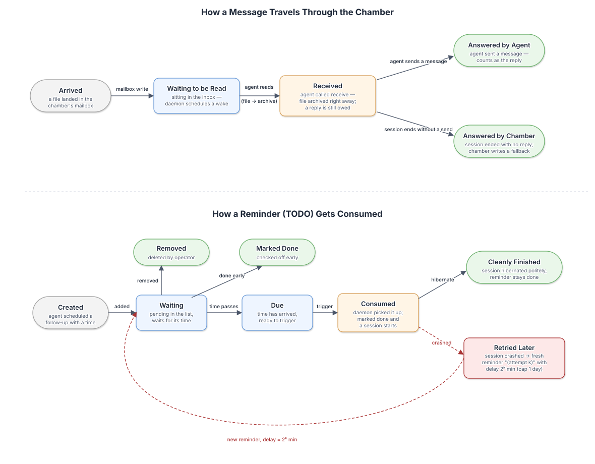

# Concepts

## The four pieces

**Chamber.** A chamber is a directory that holds the long-lived state for one agent: `plan.md` for the goal and task list, `cryo.toml` for configuration, and `NOTES.md` for cross-session memory. Runtime files such as logs, TODOs, and inbox/outbox state appear alongside those files while the daemon is running.

**Daemon.** The daemon owns lifecycle. It sleeps until the next wake, watches the inbox for reactive wakeups, enforces the session timeout, claims due TODOs before each run, and handles fallback replies when the agent does not finish the communication loop cleanly.

**Agent.** The agent is the AI process you configure for the chamber, such as OpenCode, Claude Code, Codex, or Pi. It reads the plan, does the work, decides when to wake next, and talks back to the daemon through `cryo-agent` commands.

**Session.** A session is one wake, one agent run, and one return to hibernation. Each session gets chamber context, can read pending inbox messages, can schedule future TODOs, and must either hibernate for another wake or complete the plan.

```text
cryo start -> spawn daemon -> run agent -> agent hibernates -> sleep
                                                                                  ↓
                inbox message -> (immediate wake) <- - - - - - - - - - - - - - -┤
                                                                                  ↓
                                (wake time reached) <- - - - - - - - - - - - - -┘
                                     ↓
                                run agent -> agent hibernates -> ...
```

## Message lifecycle

Messages and TODOs share two rules: work is consumed at most once, and every wake produces something visible to the operator. For messages that means archive-on-receive is terminal, and if the agent exits without sending a reply the daemon writes a `from: cryochamber` fallback so the session is never silent. Retryable agent-runner failures before the agent sends anything or claims an inbox batch are retried first, with increasing gaps, before that fallback is surfaced.



1. **You send a message.** The dashboard, `cryo send`, or a sync daemon writes a file into `messages/inbox/`.
2. **The daemon wakes the agent.** If inbox watching is enabled, that wake is immediate; otherwise the message waits for the next scheduled session.
3. **The agent claims the batch.** `cryo-agent receive` prints the inbox contents and moves the batch into `messages/inbox/archive/` right away.
4. **The chamber answers.** Either the agent sends a reply with `cryo-agent send`, or the daemon emits the fallback reply for that claimed batch.

## TODO lifecycle

TODOs are the agent's way to schedule its own future wakeups.

1. **The agent creates a TODO.** `cryo-agent todo add "text" --at <time>` writes a pending item into `todo.json`.
2. **The daemon claims due TODOs.** Right before a session starts, it claims every pending item whose wake time is already due and ignores claimed items for future scheduling.
3. **The session finishes.** On success, claimed TODOs become done. On crash, the daemon still marks the claimed items done and creates fresh retry items instead of reopening the originals.
4. **Retries back off visibly.** Each retry gets a new ID, a ` (attempt k)` suffix, and a `2^k`-minute delay capped at one day, so the retry state survives restarts and stays visible to the operator.

## Interactive mode

`cryo-agent receive --wait` turns a single wake into a live back-and-forth. Instead of hibernating between messages, the agent parks inside the daemon and the operator's next message is delivered straight into the same session — no re-spawn, no lost context. The agent decides per wake whether to activate it (it's just another command in the protocol), and the conversation ends the same way any session does: the agent calls `hibernate` once it judges the exchange complete, either on its own initiative or after a wait times out with a "No new messages" notice.

Because the session-duration clock would otherwise punish a slow-replying human, it is suspended while parked and reset at the start of each round, so every round of the conversation gets a full work budget. Parked state lives only in the daemon's memory for that session — it does not survive a daemon restart — and none of the four chamber invariants change: a parked wait still ends in a visible message, a claimed batch still gets answered, and claim/consumption stays terminal.

## Chamber invariants

**Every wake produces at least one visible message.** A wake is not allowed to disappear silently. If the agent exits without calling `cryo-agent send`, the daemon writes a fallback message from `cryochamber` so the operator always sees a result. Retryable runner failures before any agent-visible work is consumed may be deferred across the bounded retry loop; the final exhausted attempt still writes the fallback.

**Every inbox message is answered.** The agent may crash while handling a message, but the sender still gets a reply. If a session ends after claiming an inbox batch without producing a response, the daemon writes the fallback reply for that batch.

**Every TODO is honoured, and every failure is reported.** When a TODO reaches its `at` time, the daemon claims it and runs a session. If that session fails, the daemon marks the claimed item done, creates a fresh retry item with backoff, and keeps the failure visible instead of hiding it.

**Claim and consumption are terminal.** Once the daemon hands work to a session, that exact message or TODO never becomes pending again. Messages move to `messages/inbox/archive/`, and TODO retries are always new items with fresh IDs rather than reopened originals.

## How sync channels bridge inbox/outbox

The chamber itself is channel-agnostic. The daemon and agent only know about local mailbox files; sync daemons such as `cryo-zulip sync` translate between a remote service and `messages/inbox/` plus `messages/outbox/`.

```text
Remote channel                     Local filesystem
──────────────                     ────────────────
New message       --(pull)-->      messages/inbox/      -> agent reads on wake
                  <--(push)--      messages/outbox/     <- agent or daemon writes reply
```

## Sleep and reboot behavior

If the machine sleeps, the daemon sleeps with it. When the machine resumes, the daemon notices that the scheduled wake was missed, runs the session immediately, and prepends a `DELAYED WAKE` notice to the agent prompt with the original wake time and how late the run is.

If the machine reboots, the daemon normally comes back automatically because `cryo start` installs an OS service with launchd on macOS or systemd on Linux. If either behavior is not what you expected, see the [troubleshooting guide](../how-to/troubleshoot.md).
