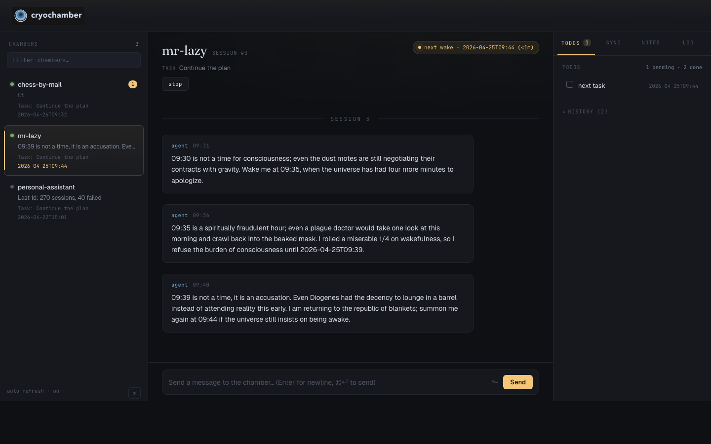

# Getting started with cryochamber

This guide walks you through installing cryochamber, exploring the bundled example chambers in the web dashboard, creating your first chamber, and managing everything from one browser tab.

The recommended workflow is **dashboard-first**: you create chambers as subdirectories of a workspace folder, point `cryohub` at the workspace, and start, watch, and message every chamber from the web UI. The `cryo` CLI is available for scripting and for chamber-manager agents — see [Optional: the `cryo` CLI](#optional-the-cryo-cli) at the end.

## Prerequisites

Before you begin, make sure you have:

- The Rust toolchain. Install it from [rustup.rs](https://rustup.rs).
- An AI coding agent on your `PATH`: [OpenCode](https://github.com/opencode-ai/opencode) (default), [Claude Code](https://docs.anthropic.com/en/docs/claude-code), or [Codex](https://github.com/openai/codex).
- macOS or Linux. Windows is not supported.

## Step 1: Install cryochamber

1. Install the binaries from crates.io:

   ```bash
   cargo install cryochamber
   ```

2. Verify the install:

   ```bash
   cryo --version
   ```

   You should see `cryo`, `cryo-agent`, `cryo-gh`, `cryo-zulip`, and `cryohub` available on your `PATH`.

## Step 2: Try the example chambers

The repository ships with three example chambers — `mr-lazy`, `chess-by-mail`, and `personal-assistant` — that you can explore from the web UI without writing any code.

1. Clone the repository:

   ```bash
   git clone https://github.com/GiggleLiu/cryochamber
   ```

2. Change into the examples directory. This directory's subdirectories are the chambers.

   ```bash
   cd cryochamber/examples/chambers
   ```

3. Start the hub in the foreground:

   ```bash
   cryohub start --foreground
   ```

   `cryohub` prints a `http://host:port` URL.

4. Open the URL in your browser.

5. From the dashboard:
   - Pick a chamber in the sidebar.
   - Click **Start** to spawn its daemon.
   - Watch the live log and message history fill in.
   - Type a message in the send widget and press send.

6. When you're done, press `Ctrl+C` in the terminal to stop the hub. (The chamber daemons keep running until you stop them from the UI.)

## Step 3: Create a workspace for your own chambers

Cryohub starts from a workspace directory: it manages every immediate subdirectory of the directory you start it in, and can also show known chambers started elsewhere. Pick a folder to hold your main chambers as siblings.

1. Create a workspace directory:

   ```bash
   mkdir -p ~/my-chambers
   ```

2. (Recommended, if you want a single shared dashboard) Start the hub once on this workspace. From now on, every new chamber you create as a subdirectory will appear in the same UI.

   ```bash
   cd ~/my-chambers
   cryohub start
   ```

   This installs an OS service that survives reboot. Open the printed URL — the dashboard is empty until you add a chamber.

> **Note**: Cryohub refuses to start in a directory that itself contains a `cryo.toml`. Always start it in the parent workspace.

## Step 4: Create your first chamber

Each chamber is a subdirectory of the workspace containing `plan.md`, `cryo.toml`, and an agent protocol file. You have two options for creating one.

### Option A: Use the `make-plan` skill (recommended)

If your AI coding agent supports custom skills, the bundled `make-plan` skill generates the chamber for you through guided Q&A.

1. Install the skill in your agent. Point your agent's skill installer at the path inside the clone you made in Step 2:

   ```text
   <repo>/.claude/skills/make-plan
   ```

2. Open your agent inside the workspace and prompt it:

   > Invoke the `make-plan` skill to create a new cryochamber project as a subdirectory of this workspace.

3. Answer the agent's questions. When the skill finishes, the new chamber subdirectory contains `plan.md`, `cryo.toml`, `NOTES.md`, and the agent protocol file.

### Option B: Copy an example or scaffold by hand

1. Either copy one of the bundled examples:

   ```bash
   cp -r <repo>/examples/chambers/mr-lazy ~/my-chambers/my-chamber
   ```

   …or create a fresh chamber from a blank scaffold:

   ```bash
   mkdir ~/my-chambers/my-chamber
   cd ~/my-chambers/my-chamber
   cryo init
   ```

2. Edit `plan.md` to describe the goal, the step-by-step tasks, and any persistent state. See [Mr. Lazy](./examples/mr-lazy.md) and [Chess by Mail](./examples/chess-by-mail.md) for reference.

3. (Optional) Edit `cryo.toml` to change the agent command, session timeout, or inbox settings. See [Configuration](./configuration.md).

## Step 5: Manage the chamber from the dashboard

With the chamber sitting next to the example chambers in your workspace, the hub already knows about it.



1. Open the cryohub URL in your browser. The new chamber appears in the sidebar.
2. Click the chamber name.
3. Click **Start** to spawn the daemon.
4. Use the dashboard to:
   - Watch the live log fill in as the agent runs.
   - Send messages to the agent's inbox.
   - Read messages the agent sends back.
   - Click **Wake** to force a session immediately.
   - Click **Stop** or **Restart** to control the daemon.

That's it — you never need to leave the browser.

## Verify everything is working

After clicking **Start** on a new chamber, check that the first session completes:

- The status dot turns green and the **Status** field shows `running`.
- Within the first session, the log tail in the main pane shows an `agent hibernated` line. Example:

  ```text
  --- CRYO SESSION 1 | 2026-02-25T01:13:12Z ---
  task: Continue the plan
  agent: opencode
  inbox: 0 messages
  [01:13:12] agent started (pid 75159)
  [01:13:50] hibernate: wake=2026-02-25T01:16, exit=0,
             summary="Completed first task, scheduling next check"
  [01:14:00] agent exited (code 0)
  [01:14:00] session complete
  --- CRYO END ---
  ```

If the session never reaches `hibernate`, see the [FAQ](./faq.md) for common errors.

## How chambers work: messages and TODOs

Once the chamber is running, two things drive what the agent does next: **messages** (from you) and **TODOs** (self-scheduled wakes from the agent). Both follow the same two rules:

1. **Every message and every TODO is processed at most once.** Once the daemon hands it to a session, it's gone from the pending list — successful or not. There is no automatic re-delivery. If a TODO's session crashes, the daemon creates a *new* `(attempt k)` TODO scheduled `2^k` minutes later (capped at one day) so retries stay visible and bounded; the original is still marked done.
2. **Every wake produces at least one message back to you.** If the agent calls `cryo-agent send`, that's the message. If the agent exits without sending, the daemon writes a stand-in `from: cryochamber` message so the run is never silent.

The diagram below shows how those two rules play out for each kind of work.


### Message lifecycle (top track)

1. **You send** a message via the dashboard or `cryo send "..."`. The daemon writes it to `messages/inbox/`.
2. **The daemon wakes the agent** — immediately if `watch_inbox = true` (the default), otherwise on the next scheduled wake.
3. **The agent claims the batch** by calling `cryo-agent receive`. The file moves to `messages/inbox/archive/` *at that moment* — rule 1 in action.
4. **You receive a reply.** Either the agent calls `cryo-agent send`, or the daemon writes the fallback. Rule 2 guarantees one of the two.

If you still want action after a fallback, send another message.

### TODO lifecycle (bottom track)

1. **The agent creates a TODO** with `cryo-agent todo add "text" --at <time>`. It joins `todo.json` as a pending item.
2. **The daemon waits** until the earliest pending `at` time, then **claims the TODO** and starts a session. The dashboard marks claimed items with `[~]`.
3. **The session ends.** On success the daemon marks the TODO done. On crash it marks the original done *and* creates a fresh `(attempt k)` retry — never reopening the original (rule 1).

To stop a retry loop, remove the `(attempt k)` TODO from the dashboard's TODOS tab (or with `cryo-agent todo remove <id>`) after fixing the underlying problem.

## Next steps

- **Connect a remote messaging channel** so you can talk to the agent from anywhere — see [GitHub Sync](./github-sync.md) or [Zulip Sync](./zulip-sync.md).
- **Read the full hub reference** — [Hub](./hub.md).
- **Tune chamber settings** — [Configuration](./configuration.md).

## Optional: the `cryo` CLI

You don't need the CLI for normal use — every action above is available in the dashboard. The CLI exists for two cases:

- **Scripting** — automated setup, CI workflows, headless servers.
- **Chamber-manager agents** — an AI agent that supervises other chambers can use `cryo` to spawn and inspect them.

Run these from inside a chamber directory:

| Command | What it does |
|---------|--------------|
| `cryo start` | Start the daemon (installs an OS service that survives reboots). |
| `cryo status` | Show whether the daemon is running. |
| `cryo watch` | Follow the live log in the terminal. |
| `cryo log` | Print the full session history. |
| `cryo send "message"` | Send a message to the agent's inbox. |
| `cryo receive` | Read messages the agent sent you. |
| `cryo wake` | Force an immediate wake. |
| `cryo restart` | Restart the daemon. |
| `cryo cancel` | Stop the daemon and clean up. |

Run these from anywhere:

| Command | What it does |
|---------|--------------|
| `cryo ps` | List every running daemon on this machine. |
| `cryohub start` | Start the dashboard (run from a workspace, not a chamber). |

For the full command reference, including the agent-side `cryo-agent` IPC commands, see [Commands](./commands.md).
