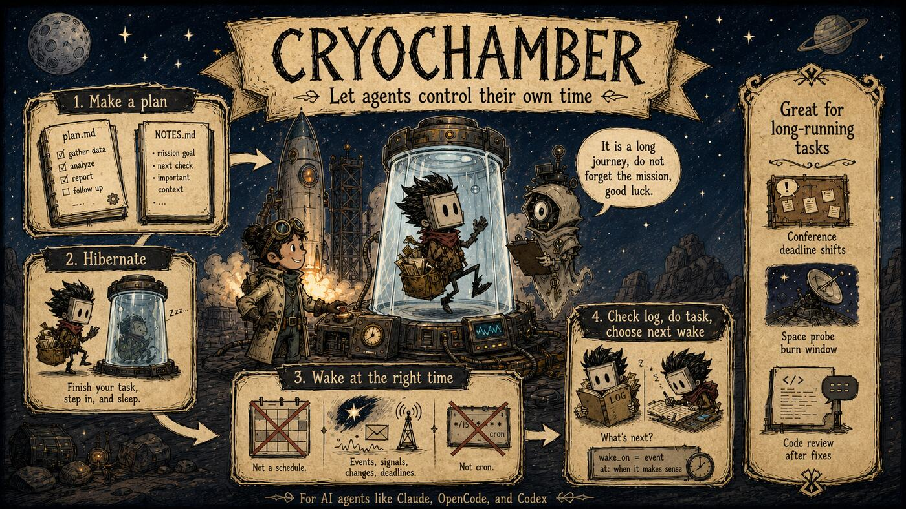

# Cryochamber

**Cryochamber is a hibernation chamber for AI agents** (Claude, OpenCode, Codex, Pi, Kimi Code). It hibernates an agent between sessions and wakes it at the right time — not on a fixed schedule. The agent reads its plan, completes a task, and decides for itself when to wake next. That lets AI agents run tasks that span days, weeks, or even years, like interstellar travelers in stasis.



## Why not cron?

Cron wakes on a fixed schedule, whether or not there is anything to do. Cryochamber hands the scheduling decision to the agent:

- **It saves tokens.** A cron-driven agent burns a full session on every tick, even when nothing has changed. A cryochamber agent sleeps until there is a reason to wake — a TODO it scheduled, or a message in its inbox.
- **It saves your brain.** With cron, a human has to guess the right schedule up front: too fast wastes money, too slow misses things. Here the agent reasons about the situation — a deadline that slipped, a review waiting on the author, a chess opponent's pace — and picks its own next wake.
- **It handles emergencies.** When something demands attention, the agent can schedule a wake minutes out, and an inbox message can wake it immediately. Cron cannot speed up when it matters.

## Get running in two minutes

> **Platform support:** macOS and Linux only.

```bash
cargo install cryochamber
mkdir my-chamber && cd my-chamber
cryo init          # scaffold plan.md and cryo.toml (or let the make-plan skill guide you)
cryo start         # start the daemon, installed as an OS service
cryohub start      # open the printed dashboard URL in your browser
```

Then edit `plan.md` to describe the agent's goal and tasks. Runnable example chambers (`mr-lazy`, `chess-by-mail`, and more) live in [`examples/chambers/`](https://github.com/GiggleLiu/cryochamber/tree/main/examples/chambers) on GitHub.

## Watch it work

```bash
cryohub start    # prints the local dashboard URL — open it in your browser
```


[Cryohub](./reference/cli.md#hub-cryohub) serves the **[Agent Console](./agent-console.md)**: one flat conversation per chamber, with the chamber's status, TODOs, notes, log tail and lifecycle controls a tap away, on a phone or a desktop browser. It is embedded in the `cryohub` binary — nothing to install. Share a single chamber with someone through an invite link, or bridge it to Zulip with [`cryo-zulip`](./reference/cli.md#zulip-sync-cryo-zulip).

## What a chamber guarantees

- **Every wake produces a visible message.** If the agent exits without replying, the daemon writes a fallback message — a session is never silent.
- **Every inbox message is answered.** Even if the agent crashes mid-session, the sender still gets a reply.
- **Every TODO is honoured.** Failed sessions are rescheduled as visible retry attempts with exponential backoff.
- **Nothing is consumed twice.** Claimed messages and TODOs never silently become pending again.

## Next

- [How it works](./how-it-works.md) — a five-minute walkthrough: the chamber files and the session loop.
- [Agent Console](./agent-console.md) — the web and phone UI: sign-in, invites, public deployment.
- [CLI reference](./reference/cli.md) — every `cryo`, `cryohub`, `cryo-agent`, and `cryo-zulip` command.
- [Configuration](./reference/configuration.md) — every `cryo.toml` and `cryohub.toml` field.
