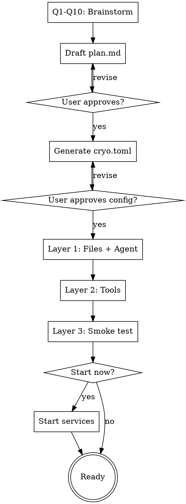

# Creating a Cryochamber Application

## Overview

Guide users through creating a cryochamber application via conversational Q&A. Four phases: brainstorm the plan, configure cryo.toml, validate everything works, optionally start.

Assumes cryo CLI is installed and on PATH.

## Phase 1: Brainstorm the Plan

Ask questions **one at a time**. Suggest answers based on the task. Multiple choice where possible.

### Q1. What's the task?

Open-ended: "What should the agent do each session?"

### Q2. Schedule pattern

Suggest based on Q1, then ask:
- **Periodic** (every N minutes/hours) — monitoring, scraping, reminders
- **Event-driven** (react to inbox messages) — responding to human input
- **Adaptive** (adjust pace based on activity) — correspondence games, polling
- **Interactive schedule table** — build a multi-step schedule collaboratively (e.g. "Day 1: send CFP, Day 7: remind reviewers, Day 14: collect results"). Good for conference organizing, editorial calendars, multi-phase projects. Co-create the table with the user row by row.

### Q3. External tools

Analyze the task and suggest likely tools (e.g. "this sounds like it needs a web scraper — would curl or a Python script work?"). **Skip if the task clearly needs no external tools.**

### Q4. Human interaction

Recommend based on task:
- **No interaction** (autonomous) — monitoring, automation
- **One-way** (agent sends reports) — scraping, summarization (Recommended for most tasks)
- **Two-way** (human sends commands/data) — games, collaborative planning

### Q5. Persistent state

What does the agent need to remember across sessions? Suggest based on task (counters, progress markers, data snapshots, timestamps). Warn: `cryo-agent note` is the **only** cross-session memory.

### Q6. Failure & retry strategy

What if the agent crashes or hangs? Suggest based on task:
- `max_retries`: how many retries (default 5). Note: after exhaustion, retries continue every 60s.

### Q7. AI agent & providers

Which agent command?
- **opencode** (default) — headless coding agent
- **claude** — Anthropic's Claude CLI
- **codex** — OpenAI's Codex CLI
- **custom** — any command

Then: do you have multiple API keys or providers to rotate between?
- If yes: walk through `[[providers]]` entries. Each needs a `name` and `env` map (e.g. `ANTHROPIC_API_KEY`). Suggest rotation strategy:
  - `quick-exit` (recommended) — rotate only on <5s exit (likely bad key)
  - `any-failure` — rotate on any crash
- If the user wants to set up providers later: skip for now and in Phase 4 tell them how to configure `[[providers]]` and `rotate_on` in `cryo.toml`.
- If no: skip, single provider is fine.

### Q8. Delayed wake reaction

If the machine was suspended and the agent wakes 5+ minutes late, how should it react? Suggest based on task:
- **Adjust and continue** (recommended for most) — recalculate deadlines, skip missed steps, catch up
- **Alert the human** — send a message about the delay, then proceed (recommended for time-sensitive tasks)
- **Abort the session** — exit with error, let human decide
- **Ignore** — treat as normal wake

### Q9. Notification & sync channel

How should the agent communicate with the user?
- **Zulip** (recommended) — rich web UI, bot support, persistent history. Walk through: zuliprc path, stream name, sync interval.
- **GitHub Discussions** — good for repo-centric workflows. Walk through: repo, discussion category.
- **Web UI only** — simplest, local browser via `cryo web`. Auto-detect an available port: start from the default (3945), check if the port is in use (e.g. `ss -tlnp | grep :3945`), increment by 1 until a free port is found, then confirm the chosen port with the user.
- **None** — agent runs silently, check logs manually.

### Q10. Periodic reports

Want daily/hourly health summaries as desktop notifications?
- If yes: set `report_time` (e.g. "09:00") and `report_interval` (hours, e.g. 24 for daily).
- If no: skip (disabled by default).

### Output

After all questions:
1. Draft `plan.md` with **Goal**, **Tasks**, **Configuration**, and **Notes** sections
2. For interactive schedule tables: embed the schedule as a markdown table in Tasks
3. Include delayed wake handling instructions in Tasks
4. Include persistent state strategy in Notes
5. Present draft to user for approval/edits
6. Write the file

Reference existing examples for plan.md structure:
- `examples/mr-lazy/plan.md` — simple periodic task
- `examples/chess-by-mail/plan.md` — adaptive event-driven task

## Phase 2: Configure cryo.toml

Generate from Phase 1 answers. No new questions — everything maps directly.

| Brainstorm answer | cryo.toml field |
|---|---|
| AI agent (Q7) | `agent` |
| Retry strategy (Q6) | `max_retries` |
| Human interaction (Q4) | `watch_inbox` (two-way → true, autonomous → false) |
| Sync channel (Q9) | `web_host`, `web_port` |
| Reports (Q10) | `report_time`, `report_interval` |
| Provider rotation (Q7) | `rotate_on`, `[[providers]]` |

Process:
1. Generate `cryo.toml` with values filled in and commented explanations
2. Present to user — highlight non-default values and explain why each was chosen
3. If Zulip or GitHub sync chosen, note that `cryo-zulip init` / `cryo-gh init` will run in Phase 3
4. Write the file

## Phase 3: Validate

Three layers, in order. On failure: stop, report what failed, suggest fixes, let user retry that layer.

### Layer 1: File validation

- Verify `plan.md` exists and contains Goal and Tasks sections
- Verify `cryo.toml` parses correctly (run `cryo init` and check for errors)
- Verify the agent command is on PATH (e.g. `which opencode`)
- Verify the AI agent can actually respond: run a minimal smoke test (e.g. `echo "reply OK" | opencode run` or `claude -p "reply OK"`) and check that it produces output without errors. This catches misconfigured API keys, missing credentials, or broken agent installations.

### Layer 2: External tool validation

- For each external tool referenced in `plan.md`: run a smoke test
  - Scripts: verify they exist and execute (e.g. `uv run chess_engine.py board`)
  - APIs: verify endpoints are reachable (e.g. `curl -sf https://... > /dev/null`)
  - Env vars: verify required variables are set and non-empty
- If provider rotation configured: validate each provider's env vars

### Layer 3: Live smoke test

1. Run `cryo init && cryo start`
2. Wait for the first session to complete (watch `cryo.log` for agent start → hibernate)
3. If sync channel configured:
   - Zulip: run `cryo-zulip init --config <path> --stream <name>` and verify connection
   - GitHub: run `cryo-gh init --repo <repo>` and verify connection
4. Run `cryo cancel` to clean up
5. Report: session count, any errors in `cryo.log`, agent exit status

On success: "Your cryo application is ready."

## Phase 4: Start

Ask the user if they want to start the plan immediately.

- If yes: run `cryo start` (and `cryo-zulip sync` / `cryo-gh sync` if a sync channel was configured). Report the status with `cryo status`.
- If no: print instructions for starting later (`cryo start`, sync commands if applicable, `cryo watch`).

If the user deferred provider setup in Q7, remind them how to configure it:
- Edit `cryo.toml` and add `rotate_on = "quick-exit"` (or `"any-failure"`)
- Add `[[providers]]` entries with `name` and `env` map, e.g.:
  ```toml
  [[providers]]
  name = "key-1"
  env = { ANTHROPIC_API_KEY = "sk-ant-..." }

  [[providers]]
  name = "key-2"
  env = { OPENAI_API_KEY = "sk-...", OPENAI_BASE_URL = "https://..." }
  ```
- Warn: add `cryo.toml` to `.gitignore` if it contains API keys.

## Process Flow



## Common Mistakes

| Mistake | Fix |
|---|---|
| Hardcoded timestamps in plan.md | Always use `cryo-agent time "+N minutes"` |
| No persistent state strategy — agent forgets everything | Use `cryo-agent note` for all cross-session state |
| Missing hibernation in plan — treated as crash | Every task path must end with `cryo-agent hibernate` |
| `watch_inbox = false` with two-way interaction | Set `watch_inbox = true` for event-driven tasks |
| Provider env vars not set | Validate in Phase 3 before starting |
